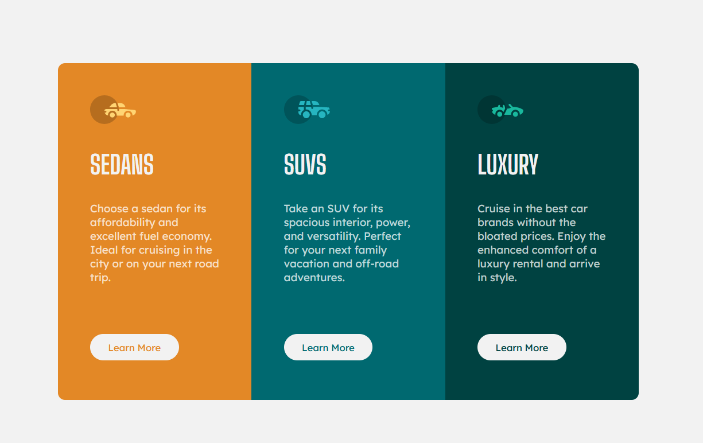

# Frontend Mentor - 3-column preview card component solution

This is a solution to the [3-column preview card component challenge on Frontend Mentor](https://www.frontendmentor.io/challenges/3column-preview-card-component-pH92eAR2-). Frontend Mentor challenges help you improve your coding skills by building realistic projects. 

## Table of contents

- [Overview](#overview)
  - [The challenge](#the-challenge)
  - [Screenshot](#screenshot)
  - [Links](#links)
- [My process](#my-process)
  - [Built with](#built-with)
  - [What I learned](#what-i-learned)
  - [Continued development](#continued-development)
  - [Useful resources](#useful-resources)
- [Author](#author)
- [Acknowledgments](#acknowledgments)

## Overview

### The challenge

Users should be able to:

- View the optimal layout depending on their device's screen size
- See hover states for interactive elements

### Screenshot

### Links

- Solution URL: [Add solution URL here](https://your-solution-url.com)
- Live Site URL: [Add live site URL here](https://your-live-site-url.com)

## My process

I build this from desktop to mobile due to the natural transformation of the UI

### Built with

- Semantic HTML5 markup
- CSS custom properties
- Flexbox

### What I learned

Practice the already known concepts

### Continued development

Keep building Frontend Mentor projects to optimize my workflow

### Useful resources

- [MDN Doc](https://developer.mozilla.org/en-US/) - MDN Documentation

## Author

- Website - [Richard 'RixCrafts' Garcia](https://www.your-site.com)
- Frontend Mentor - [@RixCrafts](https://www.frontendmentor.io/profile/RixCrafts)
- Twitter - [@Richard891021](https://twitter.com/Richard891021)

## Acknowledgments

Thanks to the Frontend Mentor Team for the posibility to practice