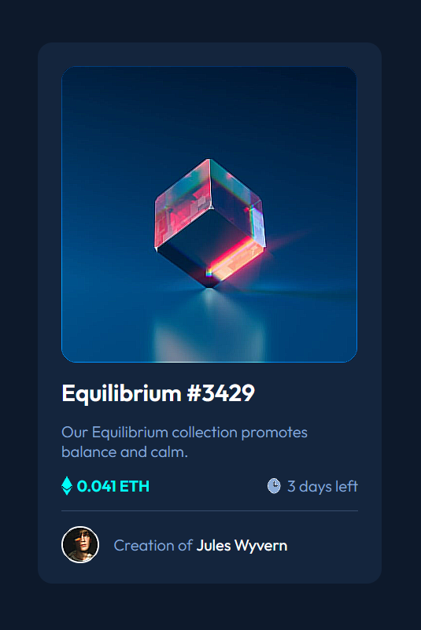

# Frontend Mentor - NFT preview card component solution

This is a solution to the [NFT preview card component challenge on Frontend Mentor](https://www.frontendmentor.io/challenges/nft-preview-card-component-SbdUL_w0U). Frontend Mentor challenges help you improve your coding skills by building realistic projects. 

## Table of contents

- [Overview](#overview)
  - [The challenge](#the-challenge)
  - [Screenshot](#screenshot)
  - [Links](#links)
- [My process](#my-process)
  - [Built with](#built-with)
- [Author](#author)
- [Acknowledgments](#acknowledgments)

## Overview

### The challenge

Users should be able to:

- View the optimal layout depending on their device's screen size
- See hover states for interactive elements

### Screenshot

- 
- 

### Links

- Solution URL: [GitHub Projetc](https://github.com/RixCrafts/Frontend-Mentor/tree/master/Projects/NFT%20Preview%20Card)
- Live Site URL: [GitHub Pages](https://rixcrafts.github.io/Frontend-Mentor/Projects/NFT%20Preview%20Card/index.html)

## My process

### Built with

- Semantic HTML5 markup
- Flexbox
- Mobile-first workflow

## Author

- Website - [Richard 'RixCrafts' Garcia](https://www.your-site.com)
- Frontend Mentor - [@RixCrafts](https://www.frontendmentor.io/profile/RixCrafts)
- Twitter - [@Richard891021](https://twitter.com/Richard891021)

## Acknowledgments

Thanks to the Frontend Mentor Team for the posibility to practice