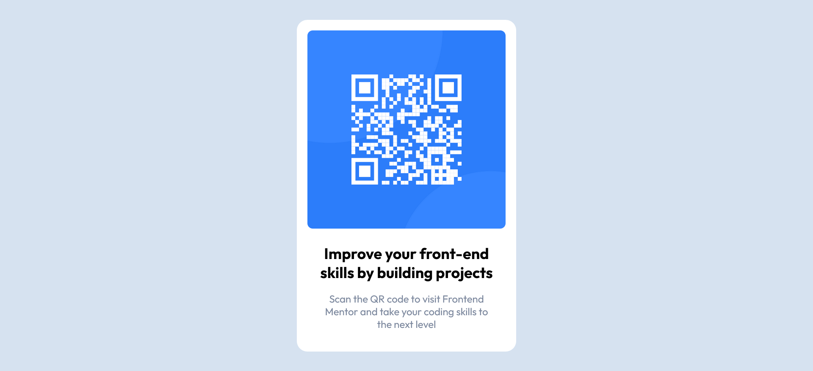

# Frontend Mentor - QR code component solution

This is a solution to the [QR code component challenge on Frontend Mentor](https://www.frontendmentor.io/challenges/qr-code-component-iux_sIO_H). Frontend Mentor challenges help you improve your coding skills by building realistic projects. 

## Table of contents

- [Overview](#overview)
  - [Screenshot](#screenshot)
  - [Links](#links)
- [My process](#my-process)
  - [Built with](#built-with)
  - [What I learned](#what-i-learned)
  - [Continued development](#continued-development)
  - [Useful resources](#useful-resources)
- [Author](#author)
- [Acknowledgments](#acknowledgments)


## Overview

A simple QR Code shower making use of HTML & CSS only. 

### Screenshot



### Links

- Solution URL: [Add solution URL here](https://your-solution-url.com)
- Live Site URL: [Add live site URL here](https://your-live-site-url.com)

## My process

- Study the overall design to delimitate diferent layout component (that will be dev), then think on the containers needed for accomplish the neccesary positioning of elements

### Built with

- Semantic HTML5 markup
- CSS custom properties
- Flexbox
- Mobile-first workflow

### What I learned

I use this exercise to practice a HTML & CSS, specially the @import command on CSS

```css
@import url('...');
```

### Continued development

Keep coding frontend mentors challenges.

### Useful resources

- [Google Font](https://fonts.google.com) - Free collection of font and icons with multiple usage ways.

## Author

- Website - [Richard 'RixCrafts' Garcia](https://www.your-site.com)
- Frontend Mentor - [@RixCrafts](https://www.frontendmentor.io/profile/RixCrafts)
- Twitter - [@Richard891021](https://twitter.com/Richard891021)

## Acknowledgments

Thanks to the Frontend Mentor Team for the posibility to practice
