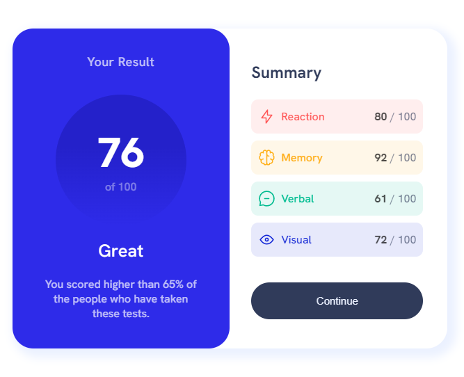

# Frontend Mentor - Results summary component solution

This is a solution to the [Results summary component challenge on Frontend Mentor](https://www.frontendmentor.io/challenges/results-summary-component-CE_K6s0maV). Frontend Mentor challenges help you improve your coding skills by building realistic projects. 

## Table of contents

- [Overview](#overview)
  - [The challenge](#the-challenge)
  - [Screenshot](#screenshot)
  - [Links](#links)
- [My process](#my-process)
  - [Built with](#built-with)
  - [What I learned](#what-i-learned)
  - [Useful resources](#useful-resources)
- [Author](#author)
- [Acknowledgments](#acknowledgments)

## Overview
A result summary component fully responsive with the data taken from a json file

### The challenge

Users should be able to:

- View the optimal layout for the interface depending on their device's screen size
- See hover and focus states for all interactive elements on the page

### Screenshot




### Links

- Solution URL: [Add solution URL here](https://your-solution-url.com)
- Live Site URL: [Add live site URL here](https://your-live-site-url.com)

## My process
Study the overall design and desided to build it for desktop first since the transition to mobile is very natural

### Built with

- Semantic HTML5 markup
- CSS custom properties
- Flexbox

### What I learned

Practice the usage of auto margin in a flexbox for element separation

To see how you can add code snippets, see below:

```html
<div class="summary-tag category-yellow">
  
  <span class="category-name"></span>
  <span class="category-score"><b></b> / 100</span>
</div>
```

The `.category-score` element will use all the available space on his left side

```css
.summary-tag {
  display: flex;
  align-items: center;
}
.category-score{
  margin-left: auto
}
```

### Useful resources

- [Google Font](https://fonts.google.com) - Free collection of font and icons with multiple usage ways.
- [MDN Docs](https://developer.mozilla.org/en-US/) - Best documentation for frontend developers

## Author

- Website - [Richard 'RixCrafts' Garcia](https://www.your-site.com)
- Frontend Mentor - [@RixCrafts](https://www.frontendmentor.io/profile/RixCrafts)
- Twitter - [@Richard891021](https://twitter.com/Richard891021)

## Acknowledgments

Thanks to the Frontend Mentor Team for the posibility to practice